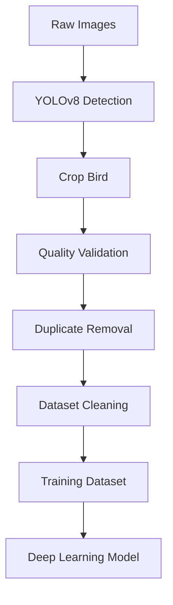

# 🐦 BirdScope — Intelligent Bird Dataset Pipeline

<div align="center">

### Bird Detection, Dataset Cleaning and Deep Learning Training Pipeline


<br>


</div>

---

# 📌 Overview

BirdScope is a preprocessing and training pipeline for bird image classification.

The project automatically detects birds, cleans datasets, removes low-quality samples and prepares balanced datasets for Deep Learning workflows.

---

# ✨ Main Features

* 🐦 Automatic bird detection with YOLOv8
* ✂️ Intelligent bird cropping
* 🧹 Dataset cleaning
* 🔍 Duplicate filtering using Perceptual Hash
* 🌫 Blur detection
* 🌑 Dark image filtering
* ☀️ Overexposed image filtering
* 📏 Resize pipeline (224x224)
* ⚖️ Dataset balancing
* 🧠 Parent → Child classification workflow
* ⚡ CUDA support

---

# 🔄 Pipeline



---

# 📂 Repository Structure

```text
Proyecto_Aves/
│
├── 1_detectar_recortar.py
├── Modelo_Entrenamiento_Padre_Hijo_Aves.ipynb
├── README.md
├── requirements.txt
│
├── dataset_original/     (not included)
├── cleaned_dataset/      (generated automatically)
├── training_padre_hijo/  (not included)
```

---

# ⚠️ Dataset

The dataset is NOT included in this repository due to storage limitations.

Expected structure:

```text
dataset_original/
├── species_1/
├── species_2/
├── species_3/
```

Add your images inside each species folder before executing the pipeline.

---

# 🧹 Cleaning Strategy

The system evaluates all images before selecting the best samples.

Applied validations:

| Validation           | Purpose                    |
| -------------------- | -------------------------- |
| Blur Detection       | Remove blurry images       |
| Dark Detection       | Remove underexposed images |
| Bright Detection     | Remove overexposed images  |
| Duplicate Removal    | Perceptual Hash filtering  |
| Bird Size Validation | Remove tiny detections     |
| Quality Ranking      | Preserve best samples      |

---

# ⚙️ Installation

Clone repository:

```bash
git clone https://github.com/Asnarck7/Proyecto_Aves.git
cd Proyecto_Aves
```

Create environment:

```bash
python -m venv venv
```

Activate:

Windows:

```bash
venv\Scripts\activate
```

Linux:

```bash
source venv/bin/activate
```

Install requirements:

```bash
pip install -r requirements.txt
```

---

# ▶️ Run Pipeline

```bash
python 1_detectar_recortar.py
```

---

# 🧠 Technologies

* Python
* YOLOv8
* OpenCV
* PyTorch
* NumPy
* Pillow
* ImageHash
* Jupyter Notebook

---

# 👨‍💻 Authors

Kevin Julian Guerrero Penagos
Laura

Computer Vision • Deep Learning • Artificial Intelligence
