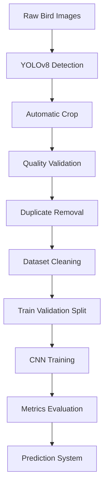
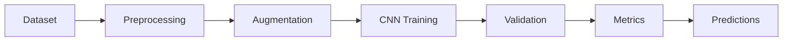

<div align="center">

# 🐦 BirdScope — Intelligent Bird Dataset Pipeline & Deep Learning Training

### Advanced Computer Vision Pipeline for Bird Classification using YOLOv8 + CNNs

<br>


<br><br>


</div>

---

# 🧠 Project Overview

BirdScope is a complete **Computer Vision and Deep Learning pipeline** focused on automatic bird dataset preprocessing and hierarchical classification training.

The system integrates:

- 🐦 YOLOv8 bird detection
- ✂️ Intelligent automatic cropping
- 🧹 Dataset cleaning and validation
- 🧠 Parent / Child classification workflows
- 📊 CNN training pipelines
- 📓 Jupyter Notebook experimentation
- ⚡ GPU acceleration support
- 🐧 Ubuntu + WSL2 optimized environment

---

# 🚀 Main Features

<div align="center">

| Feature | Description |
|---|---|
| 🐦 YOLOv8 Detection | Automatic bird localization |
| ✂️ Smart Cropping | Extracts best bird region |
| 🧹 Dataset Cleaning | Removes noisy samples |
| 🔍 Duplicate Filtering | Perceptual image hashing |
| 🌑 Brightness Validation | Removes dark/overexposed images |
| 🌫 Blur Detection | Filters blurry samples |
| 📂 Dataset Split | Automatic Train/Validation split |
| 📏 Resize Pipeline | Standardized 224x224 images |
| 🧠 CNN Ready | Training-ready structure |
| ⚡ CUDA Support | GPU acceleration |

</div>

---

# 📂 Repository Structure

```bash
BirdScope_KEVIN_LAURA/
│
├── BirdScope_KEVIN_LAURA/
│   ├── dataset/
│   ├── cleaned_dataset/
│   ├── split_dataset/
│
├── Taller_Clínica_de_Modelos-TRAINING-HIJO-LAURA_KEVIN/
│
├── 1_detectar_recortar.py
├── Modelo_Entrenamiento_Padre_Hijo_Aves.ipynb
├── README.md
├── requirements.txt
└── .git/
```

---

# 🔄 Full AI Pipeline



---

# 💻 Recommended Environment

<div align="center">

## 🐧 Ubuntu + WSL2 + Jupyter Notebook

</div>

For optimal performance in Deep Learning tasks, this project was designed to run using:

- Ubuntu 22.04 LTS
- WSL2
- Python 3.10+
- CUDA GPU acceleration
- Jupyter Notebook / JupyterLab

---

# ⚙️ Ubuntu + WSL2 Installation Guide

---

## 1️⃣ Open PowerShell as Administrator

Press:

```bash
Win + X
```

Then select:

```text
Windows PowerShell (Admin)
```

---

## 2️⃣ Install WSL2 + Ubuntu

Run:

```bash
wsl --install
```

This automatically installs:

✅ WSL2  
✅ Ubuntu Linux  
✅ Virtualization tools  
✅ Linux kernel components  

---

## 3️⃣ Restart Windows

After installation completes, restart your computer.

---

## 4️⃣ Launch Ubuntu

Search for:

```text
Ubuntu
```

from the Windows Start Menu.

The first startup may take several minutes.

---

## 5️⃣ Create Linux User

Ubuntu will request:

```bash
Username
Password
```

Example:

```bash
Username: kevin
Password: ********
```

---

# 📦 Update Ubuntu Packages

Inside Ubuntu terminal run:

```bash
sudo apt update && sudo apt upgrade -y
```

---

# 🐍 Install Python & Pip

```bash
sudo apt install python3 python3-pip -y
```

Verify installation:

```bash
python3 --version
pip3 --version
```

---

# 📓 Install Jupyter Notebook

```bash
pip install notebook jupyterlab
```

---

# 📥 Clone Repository

```bash
git clone https://github.com/YOUR_USERNAME/BirdScope_KEVIN_LAURA.git
```

---

# 📂 Navigate to Project

```bash
cd /mnt/c/Users/kevin/OneDrive/Escritorio/Electiva\ III/yolo_bird_dataset_limpiador___y___Entrenamiento_Padre_Hijo
```

---

# 📦 Install Dependencies

```bash
pip install -r requirements.txt
```

---

# ▶️ Launch Jupyter Notebook

```bash
jupyter notebook
```

or:

```bash
jupyter lab
```

---

# 🌐 Open Browser

Jupyter will generate a local URL:

```bash
http://localhost:8888
```

Open it in your browser.

---

# 🧪 Training Notebook

<div align="center">

## 📓 Modelo_Entrenamiento_Padre_Hijo_Aves.ipynb

</div>

The notebook includes:

✅ Dataset preprocessing  
✅ Augmentation pipeline  
✅ CNN training  
✅ Parent/Child classification  
✅ Evaluation metrics  
✅ Accuracy & Loss graphs  
✅ Prediction analysis  
✅ Visualization tools  

---

# 🧹 Automatic Dataset Cleaning

The preprocessing pipeline automatically removes:

<div align="center">

| Validation | Description |
|---|---|
| 🌑 Dark Images | Removes underexposed samples |
| ☀️ Bright Images | Removes overexposed samples |
| 🌫 Blur Images | Removes blurry crops |
| 🔍 Tiny Detections | Filters small birds |
| ♻️ Duplicates | Removes repeated images |

</div>

---

# 📂 Automatic Dataset Split

The repository also includes automatic dataset organization.

Generated structure:

```bash
dataset_split/
├── train/
│   ├── species_1/
│   ├── species_2/
│
├── val/
│   ├── species_1/
│   ├── species_2/
```

Split ratio:

```text
80% → Train
20% → Validation
```

---

# ⚡ GPU Acceleration

BirdScope automatically detects:

- CUDA GPU
- NVIDIA acceleration
- CPU fallback mode

---

# 📊 Training Workflow



---

# 🧠 Technologies Used

<div align="center">

| Technology | Purpose |
|---|---|
| Python | Main Language |
| YOLOv8 | Bird Detection |
| OpenCV | Image Processing |
| PyTorch | Deep Learning |
| NumPy | Numerical Operations |
| Pillow | Image Utilities |
| ImageHash | Duplicate Filtering |
| Jupyter | Experimentation |
| Ubuntu WSL2 | AI Environment |

</div>

---

# 🔥 Recommended Hardware

| Component | Recommendation |
|---|---|
| RAM | 16 GB+ |
| GPU | NVIDIA CUDA |
| Storage | SSD |
| OS | Ubuntu 22.04 |
| Python | 3.10+ |

---

# 📈 Project Goals

- Improve bird classification datasets
- Automate preprocessing workflows
- Reduce manual annotation effort
- Create reproducible AI pipelines
- Enable scalable CNN experimentation

---

# 👨‍💻 Authors

<div align="center">

## Kevin & Laura

Computer Vision • Deep Learning • AI Research

</div>

---

<div align="center">


# 🚀 Built for Artificial Intelligence Research

</div>